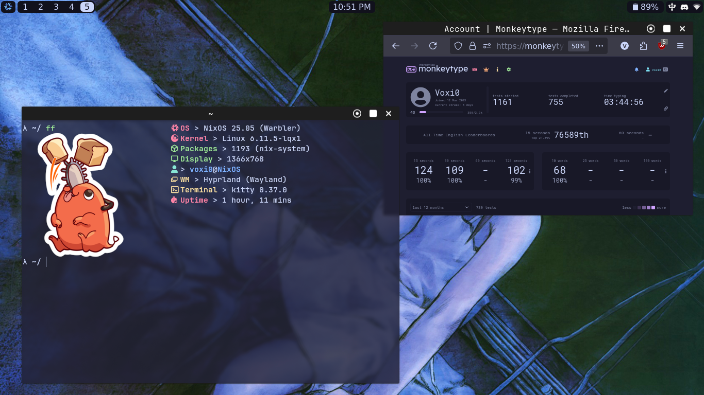
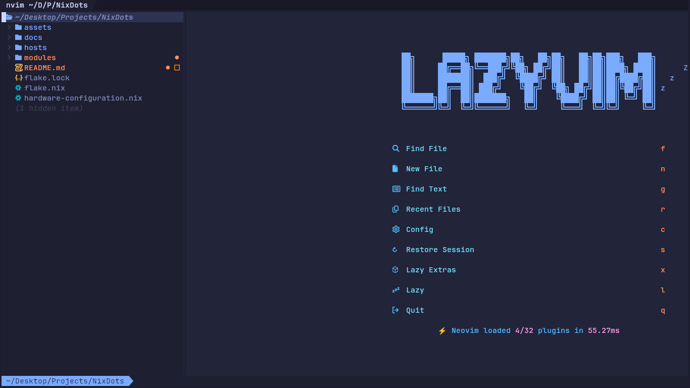

# NixDots
This repository houses my personal [NixOS](https://nixos.org/) configuration/dotfiles with [Home Manager](https://github.com/nix-community/home-manager). Feel free to use my configuration however you wish.

**NOTE:** The initial password for a user is "nixos". Change it with `passwd <username>`. Change hostname and username in `flake.nix`.

  <a href="./docs/TODO.md" style="display: inline-block; padding: 10px 20px; border: 1px solid white; border-radius: 4px; text-decoration: none; background-color: #007bff; color: white;">
    TODO
  </a>

## Info
- Kernel: Linux Latest
- Shell: Fish
- Terminal: Kitty
- Editor: [Neovim](https://github.com/Voxi0/NvimDots) (NixCats)
- DE/WM:
  - Hyprland
  - Sway (Bare Minimum, Recommended to Use Hyprland Instead)
- Widgets - Aylur's GTK Shell (AGS)
- Browser - Firefox

## Showcase

## Contributors

Made with [contrib.rocks](https://contrib.rocks).
