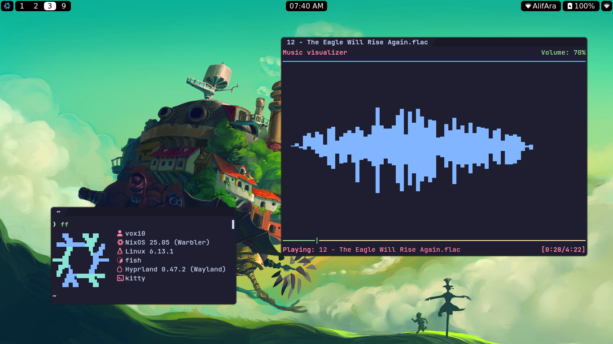
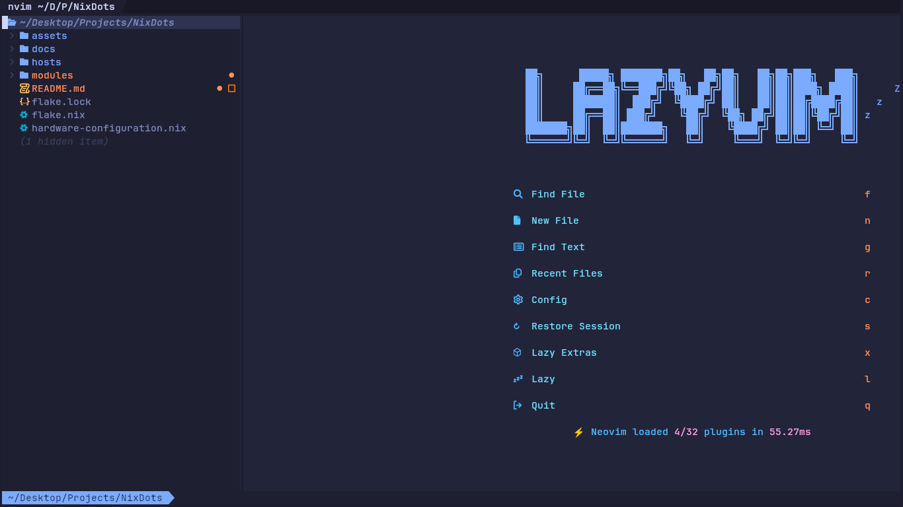

# NixDots
This is my personal [NixOS][1] configuration/dotfiles using [Flakes][2] and [Home Manager][3].
I'm also making use of [Disko][4] to declaratively partition and format disks using Nix.
Feel free to use my configuration as you wish and star the repo to show support.
Any contributions would be greatly appreciated!

<!-- Reference links -->
[1]: https://nixos.org/ "NixOS"
[2]: https://nixos.wiki/wiki/flakes/ "Flakes"
[3]: https://github.com/nix-community/home-manager/ "Home Manager"
[4]: https://github.com/nix-community/disko/ "Disko"

## Why NixOS?
Here's a couple of reasons why I considered using NixOS and eventually moved to it from [Arch Linux][5]. There are many more benefits of using NixOS but these are the most common.
- **Does not break / Easy to recover** - Rebuilding NixOS creates a new generation while preserving the previous generation. 
This allows the user to easily rollback to the previous generation if things go awry by choosing it in the boot menu.

- **Reproducibility**: It's very easy to have identical systems. All you do is fetch someone's NixOS configuration and rebuild your system using it.

- **Huge Package Repository**: [Nixpkgs][6] has over 100,000 software packages that you can install with the Nix package manager.
It's the largest software repository in existence as of now, even larger than the mighty [AUR][7]

<!-- Reference links -->
[5]: https://archlinux.org/ "Arch Linux"
[6]: https://github.com/NixOS/nixpkgs/ "Nixpkgs"
[7]: https://aur.archlinux.org/ "AUR"

## Info
- **Kernel** - [Linux (Latest)][8]
- **Shell** - [Fish][9]
- **Theming** - [Stylix][10]
- **Terminal** - [Kitty][11]
- **Editor** - [Neovim][12] (Using [NixCats][13])
- **DE/WM** - [Hyprland][14]
- **Widgets** - **WIP** [Quickshell][16]
- **Browser** - [Firefox][17]

<!-- Reference links -->
[8]: https://www.kernel.org/ "Linux (Latest)"
[9]: https://fishshell.com/ "Fish"
[10]: https://github.com/danth/stylix/ "Stylix"
[11]: https://sw.kovidgoyal.net/kitty/ "Kitty"
[12]: https://github.com/Voxi0/NvimDots/ "Neovim"
[13]: https://nixcats.org/ "NixCats"
[14]: https://hyprland.org/ "Hyprland"
[15]: https://swaywm.org/ "SwayWM"
[16]: https://quickshell.outfoxxed.me/ "Quickshell"
[17]: https://www.mozilla.org/en-US/firefox "Firefox"

## Showcase

## Contributors

Made with [contrib.rocks](https://contrib.rocks).
