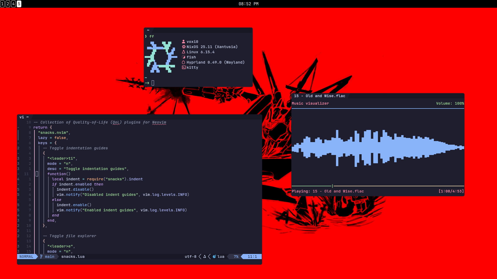
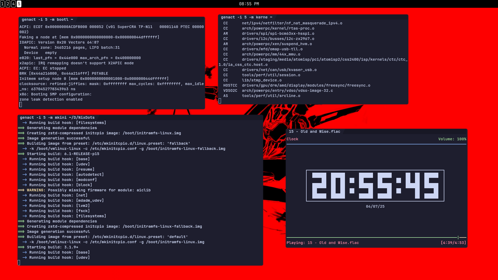

# NixDots

    
    

[NixDots](https://github.com/Voxi0/NixDots) is my personal [NixOS][1] + [Home Manager][2] configuration. Feel free to go through my configuration
and use it as you wish. And kindly star the repo to show support, any contributions are greatly appreciated :)

## Why NixOS?
[NixOS][1] is a unique Linux distribution unlike no other that's built around the Nix package manager. It has a very steep learning curve because
of how different it is from traditional distributions but for me it's worth it for many reasons. For me it's worth it but it may be different for
you, don't bother spending time on [NixOS][1] if it's benefits are unnecessary for your use case.

- **Reliability** - Thanks to declarative configuration, [NixOS][1] is able to have atomic upgrades and system rollbacks so the user can go back
to an older version/generation of the system if the new one is broken. It's difficult to break this distro
- **Reproducibility**: Declarative configuration means that the same configuration can be used to create identical [NixOS][1] systems just by
rebuilding the system using that configuration.
- **Huge Package Repository**: [Nixpkgs][3] has over 100,000 software packages that you can install with the Nix package manager. It's the largest
software repository in existence as of now, even larger than the mighty [Arch User Repository (AUR)][4]

## Specs
- **Kernel** - [Linux (Latest)][5]
- **Shell** - [Fish][6]
- **Terminal** - [Kitty][7]
- **Editor** - [Neovim][8] (Using [nixCats][9])
- **DE/WM** - [Hyprland][10]
- **Widgets** - [Quickshell][11]
- **App Theme** - [Catppuccin Mocha][12]
- **Icon Theme** - [Papirus][13]
- **Cursor Theme** - [Bibata Modern Ice][14]

## Showcase

## Contributors

    

<!-- Reference links -->
[1]: https://nixos.org/ "NixOS"
[2]: https://github.com/nix-community/home-manager/ "Home Manager"
[3]: https://github.com/NixOS/nixpkgs/ "Nixpkgs"
[4]: https://aur.archlinux.org/ "AUR"
[5]: https://www.kernel.org/ "Linux (Latest)"
[6]: https://fishshell.com/ "Fish"
[7]: https://sw.kovidgoyal.net/kitty/ "Kitty"
[8]: https://github.com/Voxi0/NvimDots/ "Neovim"
[9]: https://nixcats.org/ "NixCats"
[10]: https://hyprland.org/ "Hyprland"
[11]: https://quickshell.outfoxxed.me/ "Quickshell"
[12]: https://catppuccin.com/ "Catppuccin"
[13]: https://github.com/PapirusDevelopmentTeam/papirus-icon-theme/ "Papirus"
[14]: https://github.com/ful1e5/bibata/ "Bibata"
